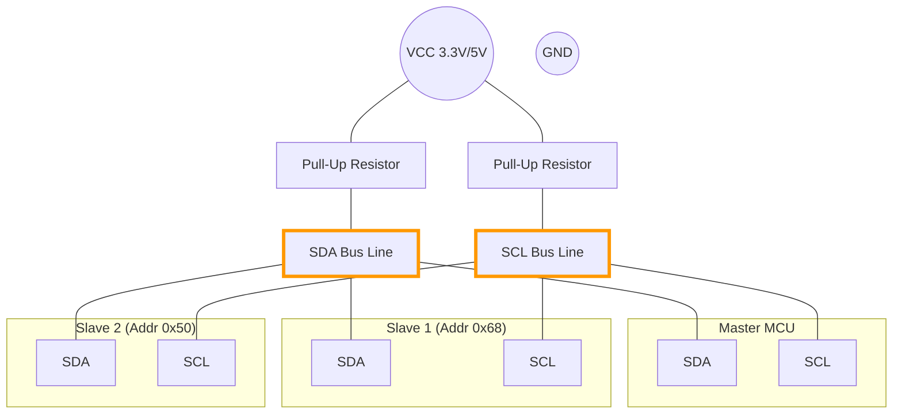

# I2C (Inter-Integrated Circuit)

I2C (pronounced "I-squared-C" or "I-two-C") is a synchronous, multi-master, multi-slave packet switched, single-ended, serial computer bus. It is widely used for attaching lower-speed peripheral ICs to processors and microcontrollers in short-distance, intra-board communication.

## 📌 Key Characteristics

*   **Type**: Synchronous Serial
*   **Wires**: 2 Signal Wires (SDA, SCL) + GND
*   **Duplex**: Half-Duplex (Data goes one way at a time)
*   **Addressing**: Software-based (Each device has a 7-bit unique address)
*   **Speed**:
    *   Standard Mode: 100 kbit/s
    *   Fast Mode: 400 kbit/s
    *   High Speed: 3.4 Mbit/s

## 🔌 Wiring Connection (Architecture)

I2C uses "Open Drain" drivers with **Pull-Up Resistors**.

| Pin | Name | Description |
| :--- | :--- | :--- |
| **SDA** | Serial Data | Bi-directional data line. |
| **SCL** | Serial Clock | Clock line (usually driven by Master). |

> **Critical**: You need a resistor (typically 4.7kΩ) connecting SDA to VCC and SCL to VCC.

## 📦 Protocol Structure

I2C is transaction-based. A basic write sequence looks like this:

1.  **Start Condition**: SDA goes Low while SCL is High.
2.  **Address Frame**: Master sends 7-bit Address + 1 Read/Write bit (0 for Write, 1 for Read).
3.  **ACK/NACK**: The Slave pulls SDA Low to Acknowledge (ACK). If High, it's a NACK.
4.  **Data Frames**: 8-bit Data byte + 1 ACK bit from Receiver.
5.  **Stop Condition**: SDA goes High while SCL is High.

### Addressing
Every I2C device has a hardcoded address (e.g., `0x68` for an RTC).
*   **7-bit Address**: 128 possible addresses.
*   **10-bit Address**: Rare, but allows more devices.

## 💻 Code Examples

See `examples/` for:
1.  **I2C Scanner (Arduino)**: This is the most useful tool you will ever possess. It runs through all addresses (0-127) and reports where it finds a device. Use this if you don't know your sensor's address!
2.  **FPGA (SystemVerilog)**: An I2C Master with advanced **NACK Detection** (for both Address and Data phases) and explicit Error States.
3.  **Python (SMBus)**: For Raspberry Pi interaction.
