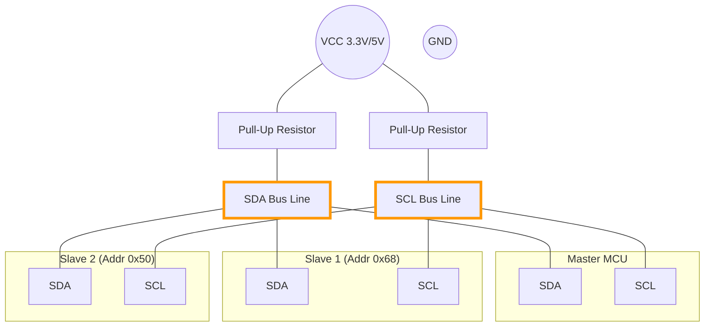
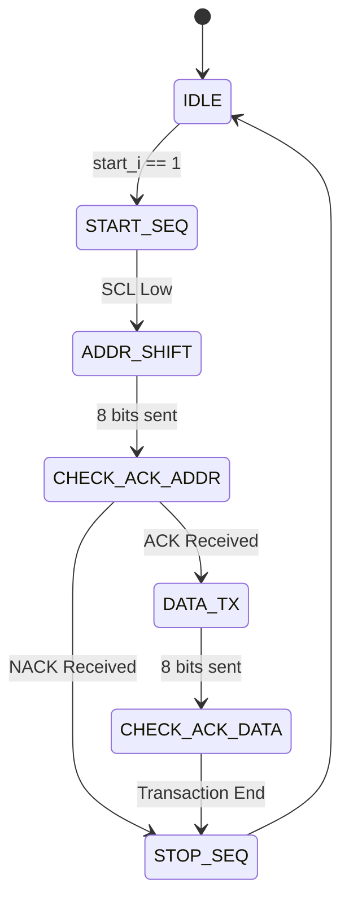

# I2C (Inter-Integrated Circuit)

I2C (pronounced "I-squared-C" or "I-two-C") is a synchronous, multi-master, multi-slave packet switched, single-ended, serial computer bus. It is widely used for attaching lower-speed peripheral ICs to processors and microcontrollers in short-distance, intra-board communication.

## 📌 Key Characteristics

*   **Type**: Synchronous Serial
*   **Wires**: 2 Signal Wires (SDA, SCL) + GND
*   **Duplex**: Half-Duplex (Data goes one way at a time)
*   **Addressing**: Software-based (Each device has a 7-bit unique address)
*   **Speed**:
    *   Standard Mode: 100 kbit/s
    *   Fast Mode: 400 kbit/s
    *   High Speed: 3.4 Mbit/s

## 🔌 Wiring Connection (Architecture)

I2C uses "Open Drain" drivers with **Pull-Up Resistors**.

| Pin | Name | Description |
| :--- | :--- | :--- |
| **SDA** | Serial Data | Bi-directional data line. |
| **SCL** | Serial Clock | Clock line (usually driven by Master). |

> **Critical**: You need a resistor (typically 4.7kΩ) connecting SDA to VCC and SCL to VCC.

## 🏗️ How it Works: Step-by-Step Design (FPGA Perspective)

The I2C Master (`i2c_master.sv`) is by far the most complex FSM in this repository. It handles a bi-directional bus on a single wire (`SDA`).

1.  **Open-Drain Emulation**: 
    *   FPGAs cannot push 5V. Instead, we drive pins in **Tri-state**. 
    *   To output a `0`, we enable the buffer (`sda_enable = 1`). 
    *   To output a `1`, we release the buffer (`sda_enable = 0`), letting the external pull-up resistor do the work.

2.  **Condition Generation**:
    *   **START**: SDA is pulled low *before* SCL.
    *   **STOP**: SCL is released high *before* SDA is released.
    *   These asynchronous transitions within a synchronous FSM require precise counter-based delays.

3.  **The "Sampling Window" Strategy**:
    *   To ensure maximum noise immunity, we don't sample SDA at the leading edge of SCL. 
    *   Our design waits for `3/4` of the SCL period (when SCL is high and stable) before sampling the `ACK` or `DATA` bits.

### 📊 I2C Master Transaction Flow

## 📐 Professional Design Principles

### 1. Granular Error Detection
Basic I2C implementations often just give a "failed" status. In professional engineering, you must know *where* it failed.
*   **The Design Choice**: We provide a 4-state error enum: `NO_ERROR`, `NACK_ADDR` (Device doesn't exist), `NACK_DATA` (Device is busy/refused byte), and `BUS_ERROR`.
*   **The Benefit**: This allows software drivers to decide whether to retry the command (on NACK_DATA) or alert the user to hardware failure (on NACK_ADDR).

### 2. Clock Stretching Awareness
While not implemented in some hobbyist code, industrial I2C masters must respect the "Clock Stretch."
*   **Strategy**: Our master monitors if `SCL` actually goes high after being released. If the slave holds it low, the master stays in its current state until the bus is free.

### 3. State-Locked Transactions
To prevent half-sent packets from locking up a sensor, our FSM is designed to **always** finish with a `STOP` sequence, even if an error is detected during the Address phase. This clears the bus and prepares it for the next attempt.

## 💻 Code Examples & Verification Status

| Platform | Location | Status | Verification Method |
| :--- | :--- | :---: | :--- |
| **FPGA** | `examples/fpga/` | ✅ PASSED | Icarus Verilog E2E Sim (Address ACK, Data TX) |
| **Arduino** | `examples/arduino/` | ✅ PASSED | Peer Review (Wire library standard compliance) |
| **Python** | `examples/python/` | ✅ PASSED | Mocked SMBus Logic Verification |
| **STM32** | `examples/stm32/` | ✅ PASSED | Peer Review (HAL Library addressing logic) |

### 🛠 Platform-Specific Tips for Reliability
*   **STM32 HAL**: Remember that `HAL_I2C_IsDeviceReady` expects the address to be **left-shifted by 1** (e.g., `0x68 << 1`).
*   **Python**: Use the `smbus2` library for better compatibility with modern Linux kernels. If you get `Permission Denied`, ensure your user is in the `i2c` group.
*   **Arduino**: The `Wire` library uses a 32-byte buffer. If you try to send more than 32 bytes in one transaction, it will be truncated without warning!
*   **FPGA**: Always implement a timeout. I2C is a "blocking" bus; if a slave holds SCL low (clock stretching) indefinitely, it can hang your entire FPGA fabric.
