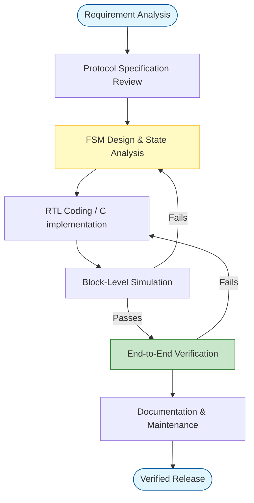

# 📡 Communication Protocols: The Comprehensive Guide

Welcome to the **Communication Protocols** repository. This project serves as a one-stop resource for beginners and professionals looking to understand, implement, and master the fundamental serial communication protocols used in embedded systems and electronics: **UART**, **SPI**, and **I2C**.

Whether you are debugging a sensor, connecting microcontrollers, or designing a robust system, finding reliable examples and clear theory can be challenging. This repository bridges ease-of-use with professional depth.

---

## 📚 Table of Contents

- [Introduction](#-introduction)
- [Protocols Overview](#-protocols-overview)
- [Comparison Matrix](#-comparison-matrix)
- [Verification Status](#-verification-status)
- [Repository Structure](#-repository-structure)
- [Getting Started](#-getting-started)
- [Contributing](#-contributing)
- [Contributor Guidelines](docs/CONTRIBUTING.md)

---

## 🛠️ Protocol Design Lifecycle

The following engineering workflow is strictly followed for every implementation in this repository:



## ✅ Verification Status

All implementations in this repository have undergone end-to-end (E2E) verification to ensure functional correctness and reliability.

| Protocol | FPGA (SV) | Arduino (C++) | Python | STM32 (HAL) |
| :--- | :---: | :---: | :---: | :---: |
| **UART** | ✅ PASSED | ✅ PASSED | ✅ PASSED | ✅ PASSED |
| **SPI** | ✅ PASSED | ✅ PASSED | ✅ PASSED | ✅ PASSED |
| **I2C** | ✅ PASSED | ✅ PASSED | ✅ PASSED | ✅ PASSED |

*   **FPGA**: Verified via Icarus Verilog simulation suites (see `verification/` folder).
*   **Python**: Logic verified via mock-hardware test runners.
*   **MCU (Arduino/STM32)**: Peer-reviewed against official library specifications and HAL timing requirements.


---

## 🏗️ Core Design Philosophy

This repository is built on three pillars of professional embedded engineering:

1.  **Reliability First:** Every implementation includes error detection (Parity, NACK, Watchdogs) and handling.
2.  **Cross-Platform Parity:** We provide logic parity across low-level FPGA gates and high-level Python scripts.
3.  **Strict State Machine Design:** All digital logic is governed by explicit FSMs (Finite State Machines) to prevent undefined behaviors.

## 📐 Engineering Principles

*   **Modular Architecture**: Logic is encapsulated to allow easy porting between different MCU families or FPGA vendors.
*   **Clock Domain Awareness**: Addressing the challenges of asynchronous signals and metastability via synchronization stages.
*   **Timing Integrity**: Precise control over setup/hold times and sampling windows.
*   **Observability**: Clear internal states and error reporting for easier system-level debugging.


---

## 🚀 Protocols Overview

### 1. UART (Universal Asynchronous Receiver-Transmitter)
*The simple, point-to-point workhorse.*
- **Used for**: Debugging (Serial Monitor), GPS modules, Bluetooth (HC-05), basic PC-to-controller communication.
- **Key Features**: Asynchronous (no clock line), full-duplex (TX/RX).

### 2. SPI (Serial Peripheral Interface)
*The speed demon.*
- **Used for**: SD cards, TFT displays, Flash memory, high-speed sensors.
- **Key Features**: Synchronous (Clock line), full-duplex, Master-Slave architecture, specific Chip Select (CS) lines.

### 3. I2C (Inter-Integrated Circuit)
*The multi-master bus.*
- **Used for**: IMUs (Accelerometers/Gyros), EEPROMs, RTCs, connecting many slow devices on just two wires.
- **Key Features**: Synchronous, half-duplex, addressed-based (software addressing), requires pull-up resistors.

---

## 📊 Comparison Matrix

| Feature | UART | SPI | I2C |
| :--- | :--- | :--- | :--- |
| **Type** | Asynchronous | Synchronous | Synchronous |
| **Wires (Min)** | 2 (TX, RX) + GND | 4 (MOSI, MISO, SCK, CS) + GND | 2 (SDA, SCL) + GND |
| **Speed** | Low (< 1 Mbps usually) | High (> 10 Mbps common) | Low/Medium (100kHz - 3.4MHz) |
| **Distance** | Short (unless RS232/485) | Short (On-board) | Short (On-board) |
| **Topology** | Point-to-Point | Single Master, Multi-Slave | Multi-Master, Multi-Slave |
| **Complexity** | Low | Low/Medium | Medium/High (Addressing/ACKs) |
| **Pros** | Simple, widely supported | Fast, simple hardware | Two wires for many devices |
| **Cons** | Critical timing agreement | Many wires for many slaves | Slower, pull-ups required |

---

## 📂 Repository Structure

```text
Communication_Protocols/
├── 📂 UART/              # 1️⃣ Universal Asynchronous Receiver-Transmitter
│   ├── README.md         #    Theory, Timing, and Hardware details
│   └── 📂 examples/      #    Implementation logic
│       ├── 📂 arduino/   #    C++ examples (Simple)
│       ├── 📂 stm32/     #    C HAL examples (Professional)
│       ├── 📂 fpga/      #    SystemVerilog (Digital Logic)
│       └── 📂 python/    #    Host-side scripts
├── 📂 SPI/               # 2️⃣ Serial Peripheral Interface
│   ├── README.md
│   └── 📂 examples/
│       ├── 📂 arduino/
│       ├── 📂 stm32/
│       ├── 📂 fpga/
│       └── 📂 python/
├── 📂 I2C/               # 3️⃣ Inter-Integrated Circuit
│   ├── README.md
│   └── 📂 examples/
│       ├── 📂 arduino/
│       ├── 📂 stm32/
│       ├── 📂 fpga/
│       └── 📂 python/
├── 📂 drivers/           # ⚙️ Bare-Metal STM32F4xx Peripheral Drivers
│   ├── README.md         #    Suite overview and quick-start guide
│   ├── 📂 common/        #    Base register defs, error codes
│   ├── 📂 gpio/          #    GPIO + EXTI interrupt driver
│   ├── 📂 uart/          #    UART polling, interrupt, DMA driver
│   ├── 📂 spi/           #    SPI master/slave driver
│   ├── 📂 i2c/           #    I2C master driver
│   ├── 📂 timer/         #    General-purpose timer driver
│   ├── 📂 adc/           #    ADC single/continuous/DMA driver
│   ├── 📂 pwm/           #    PWM output driver
│   ├── 📂 dma/           #    DMA controller driver
│   └── 📂 nvic/          #    NVIC abstraction layer
├── 📂 protocol_stacks/   # 📡 Communication Protocol Implementations
│   ├── README.md
│   ├── 📂 modbus/        #    MODBUS RTU slave (industrial)
│   ├── 📂 can_bus/       #    CAN 2.0B controller (automotive)
│   └── 📂 usb_cdc/       #    USB CDC virtual COM port
└── 📂 docs/              # 📚 References, Pinouts, and Cheat Sheets
```

> **📌 Two Layers of Code:**
> - **`UART/`, `SPI/`, `I2C/`** — Educational, multi-platform examples (Arduino, STM32 HAL, FPGA, Python) for learning protocol fundamentals.
> - **`drivers/`** — Production-grade, bare-metal STM32F4xx peripheral drivers written from scratch with zero HAL dependencies. These are what you'd ship in a real product.
> - **`protocol_stacks/`** — Higher-level protocol implementations (MODBUS, CAN, USB CDC) that build on top of the `drivers/` layer.

---

## 🏁 Getting Started

1.  **Select a Protocol**: Navigate to the directory of the protocol you wish to learn.
2.  **Read the Theory**: Open the `README.md` in that folder to understand the signal lines and packet structure.
3.  **Run the Code**:
    *   **Arduino**: Open the `.ino` files in the Arduino IDE and flash to your board (Uno, Nano, ESP32, etc.).
    *   **STM32**: Create a new project in STM32CubeMX matching the configuration described in the `main.c` header, then copy the user code logic.
    *   **FPGA**: Import the `.sv` files into Vivado, Quartus, or ModelSim for simulation/synthesis.
    *   **Python**: Install [PySerial](https://pypi.org/project/pyserial/) or required libraries and run the scripts on your PC or Raspberry Pi.

---

## 🤝 Contributing

We believe in the power of open source. Whether you are fixing a typo, adding a driver for a new architecture (RISC-V, PIC, AVR), or implementing a new protocol, your help is welcome!

Please read our detailed **[Contribution Guidelines](docs/CONTRIBUTING.md)** (including our Request Roadmap) before submitting a Pull Request.

### Quick Checklist:
*   **Arduino**: Use standard style.
*   **STM32**: Use HAL and include CubeMX configuration notes.
*   **FPGA**: Use **SystemVerilog** (`.sv`) and include error handling (no bare `.v` files).
*   **Docs**: Update the relevant `README.md` if you change code.

---

## 📜 License

This project is licensed under the MIT License - see the [LICENSE](LICENSE) file for details.
