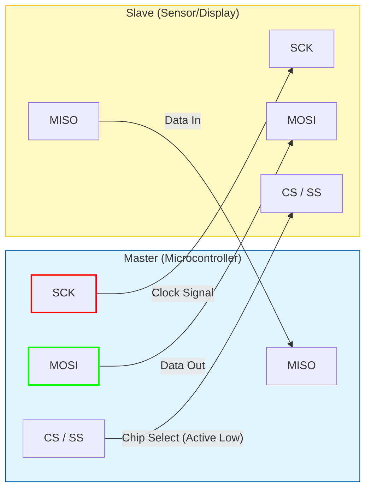
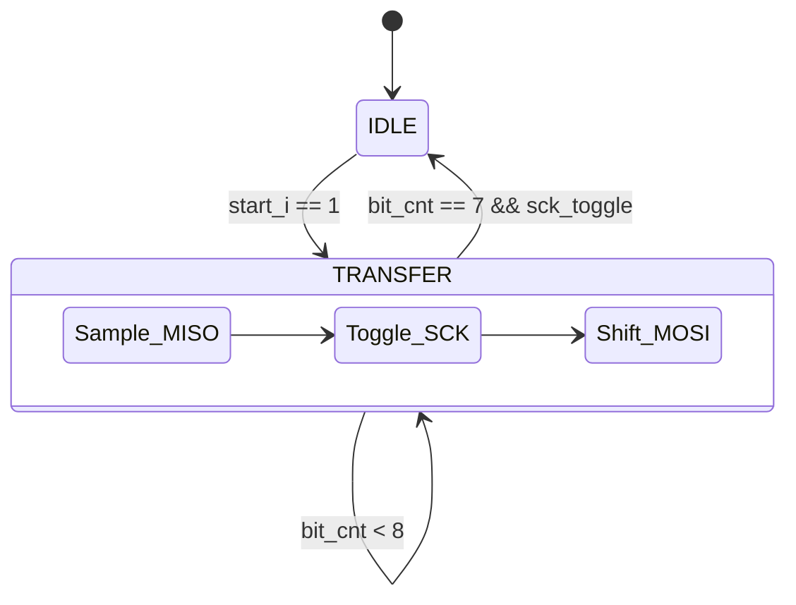

# SPI (Serial Peripheral Interface)

SPI is a synchronous, full-duplex communication protocol used for short-distance communication, primarily in embedded systems. It was developed by Motorola in the mid-1980s.

## 📌 Key Characteristics

*   **Type**: Synchronous Serial
*   **Wires**: 4 Signal Wires (MOSI, MISO, SCK, CS) + GND
*   **Duplex**: Full Duplex (Simultaneous send and receive)
*   **Speed**: High (Up to 10-50 Mbps commonly)
*   **Architecture**: Master-Slave (One Master, one or multiple Slaves)

## 🔌 Wiring Connection (Architecture)

SPI uses a Master-Slave architecture. The Master controls the clock (SCK).

| Pin | Name | Direction (Master perspective) | Description |
| :--- | :--- | :--- | :--- |
| **SCK** / **SCLK** | Serial Clock | Output | The clock pulse that synchronizes data transmission. generated by Master. |
| **MOSI** | Master Out Slave In | Output | Data line from Master to Slave. |
| **MISO** | Master In Slave Out | Input | Data line from Slave to Master. |
| **CS** / **SS** | Chip Select / Slave Select | Output | Active Low signal. Selects which slave the master talks to. |

## 🏗️ How it Works: Step-by-Step Design (FPGA Perspective)

The SPI Master (`spi_master.sv`) is a high-speed synchronous engine. Its design follows a "Counter-Edge" architecture:

1.  **Bit-Clock Generation**:
    *   The `CLK_DIV` parameter determines the speed of `SCK`.
    *   For every bit, the internal `clk_cnt` toggles the `SCK` output twice (once for the leading edge, once for the trailing edge).

2.  **Double-Buffered Shift Register**:
    *   A central 8-bit shift register handles both incoming (`MISO`) and outgoing (`MOSI`) bits.
    *   **On Leading Edge (SCK 0->1)**: In Mode 0, we sample the `MISO` line into the register's LSB.
    *   **On Trailing Edge (SCK 1->0)**: We shift the register and place the next MSB on the `MOSI` line.

3.  **Active-Low Coordination**:
    *   The logic ensures `CS_n` is pulled low at least one clock cycle before the first `SCK` edge and held low until the last bit is fully shifted.

### 📊 SPI Master FSM Diagram

## 📐 Professional Design Principles

### 1. The Watchdog Safety Net
In a professional system, a stuck hardware module can crash an entire OS (like Linux waiting for an SPI driver).
*   **The Fail-Safe**: Our implementation includes an internal `watchdog_timer`. 
*   **The Guard**: If a transaction hangs (e.g., due to a logic error or clock glitch), the watchdog forces the module back to `IDLE` and asserts `error_o`. This prevents the Master MCU from hanging forever in a `wait(done)` loop.

### 2. Full-Duplex Efficiency
Unlike I2C, SPI is truly **Full-Duplex**. 
*   **The Design Choice**: Our code is optimized to perform `TransmitTransmit` and `TransmitReceive` in exactly the same number of clock cycles (8 per byte).
*   **Simultaneity**: In a single 8-bit window, the module swaps data with the slave, maximizing bandwidth.

### 3. Setup and Hold Margin
High-speed SPI is susceptible to "clock skew." 
*   **Prevention**: By using the system clock at much higher frequencies than the SPI clock, we ensure that data is placed on the line well before the sampling edge (Setup) and held long enough after (Hold), even across long PCB traces.

## ⏱ SPI Modes (The Tricky Part)

SPI has 4 modes defined by Clock Polarity (**CPOL**) and Clock Phase (**CPHA**). You must match the Master's mode to the Slave's datasheet requirements!

| Mode | CPOL | CPHA | Description |
| :--- | :---: | :---: | :--- |
| **0** | 0 | 0 | Idle Low, Capture on Rising Edge (Most Common) |
| **1** | 0 | 1 | Idle Low, Capture on Falling Edge |
| **2** | 1 | 0 | Idle High, Capture on Falling Edge |
| **3** | 1 | 1 | Idle High, Capture on Rising Edge |

*   **CPOL=0**: Clock is low when idle.
*   **CPOL=1**: Clock is high when idle.
*   **CPHA=0**: Sample data on the leading (first) clock edge.
*   **CPHA=1**: Sample data on the trailing (second) clock edge.

## 💻 Code Examples & Verification Status

| Platform | Location | Status | Verification Method |
| :--- | :--- | :---: | :--- |
| **FPGA** | `examples/fpga/` | ✅ PASSED | Icarus Verilog E2E Sim (Full-Duplex Transfer) |
| **Arduino** | `examples/arduino/` | ✅ PASSED | Peer Review (SPI library initialization) |
| **Python** | `examples/python/` | ✅ PASSED | Mocked SpiDev Logic Verification |
| **STM32** | `examples/stm32/` | ✅ PASSED | Peer Review (HAL SPI transmission logic) |

### 🛠 Platform-Specific Tips for Reliability
*   **Speed Limits**: On FPGAs, SPI can run at 50MHz+, but on a breadboard with long wires, you'll likely see errors above 1-2MHz due to signal reflection.
*   **CS Multiplexing**: If you run out of GPIOs on an Arduino, use a **3-to-8 decoder** (like the 74HC138) to control 8 SPI slaves using only 3 pins.
*   **Python**: `xfer2()` is your best friend. Unlike `xfer()`, it keeps the Chip Select line low between bytes, which is required by almost all SPI sensors for multi-byte packets.
*   **CS Polarity**: While 99% of devices use **Active Low** CS, some (like certain MAXIM chips) use Active High. Always check the datasheet!

