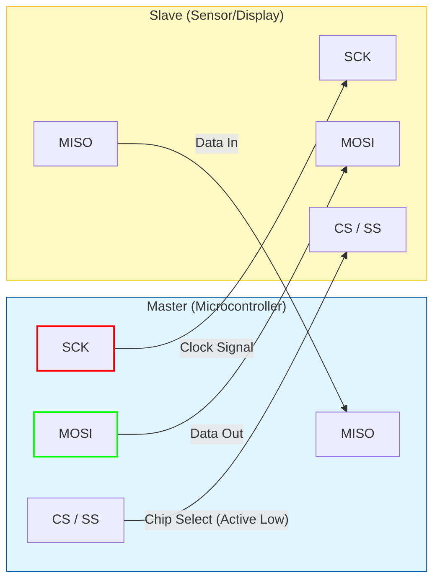

# SPI (Serial Peripheral Interface)

SPI is a synchronous, full-duplex communication protocol used for short-distance communication, primarily in embedded systems. It was developed by Motorola in the mid-1980s.

## 📌 Key Characteristics

*   **Type**: Synchronous Serial
*   **Wires**: 4 Signal Wires (MOSI, MISO, SCK, CS) + GND
*   **Duplex**: Full Duplex (Simultaneous send and receive)
*   **Speed**: High (Up to 10-50 Mbps commonly)
*   **Architecture**: Master-Slave (One Master, one or multiple Slaves)

## 🔌 Wiring Connection (Architecture)

SPI uses a Master-Slave architecture. The Master controls the clock (SCK).

| Pin | Name | Direction (Master perspective) | Description |
| :--- | :--- | :--- | :--- |
| **SCK** / **SCLK** | Serial Clock | Output | The clock pulse that synchronizes data transmission. generated by Master. |
| **MOSI** | Master Out Slave In | Output | Data line from Master to Slave. |
| **MISO** | Master In Slave Out | Input | Data line from Slave to Master. |
| **CS** / **SS** | Chip Select / Slave Select | Output | Active Low signal. Selects which slave the master talks to. |

## 📐 Topology

### Single Master, Single Slave
Direct connection of all 4 pins.

### Single Master, Multiple Slaves
*   **Shared Bus**: SCK, MOSI, and MISO are shared among all slaves.
*   **Unique CS**: Each slave has its own Chip Select wire connected to the Master. The Master pulls **Low** only the CS pin of the device it wants to talk to.

## ⏱ SPI Modes (The Tricky Part)

SPI has 4 modes defined by Clock Polarity (**CPOL**) and Clock Phase (**CPHA**). You must match the Master's mode to the Slave's datasheet requirements!

| Mode | CPOL | CPHA | Description |
| :--- | :---: | :---: | :--- |
| **0** | 0 | 0 | Idle Low, Capture on Rising Edge (Most Common) |
| **1** | 0 | 1 | Idle Low, Capture on Falling Edge |
| **2** | 1 | 0 | Idle High, Capture on Falling Edge |
| **3** | 1 | 1 | Idle High, Capture on Rising Edge |

*   **CPOL=0**: Clock is low when idle.
*   **CPOL=1**: Clock is high when idle.
*   **CPHA=0**: Sample data on the leading (first) clock edge.
*   **CPHA=1**: Sample data on the trailing (second) clock edge.

## 💻 Code Example

See the `examples/` folder.
*   **Arduino**: Uses the `<SPI.h>` library.
*   **RPi (Python)**: Uses `spidev`.
