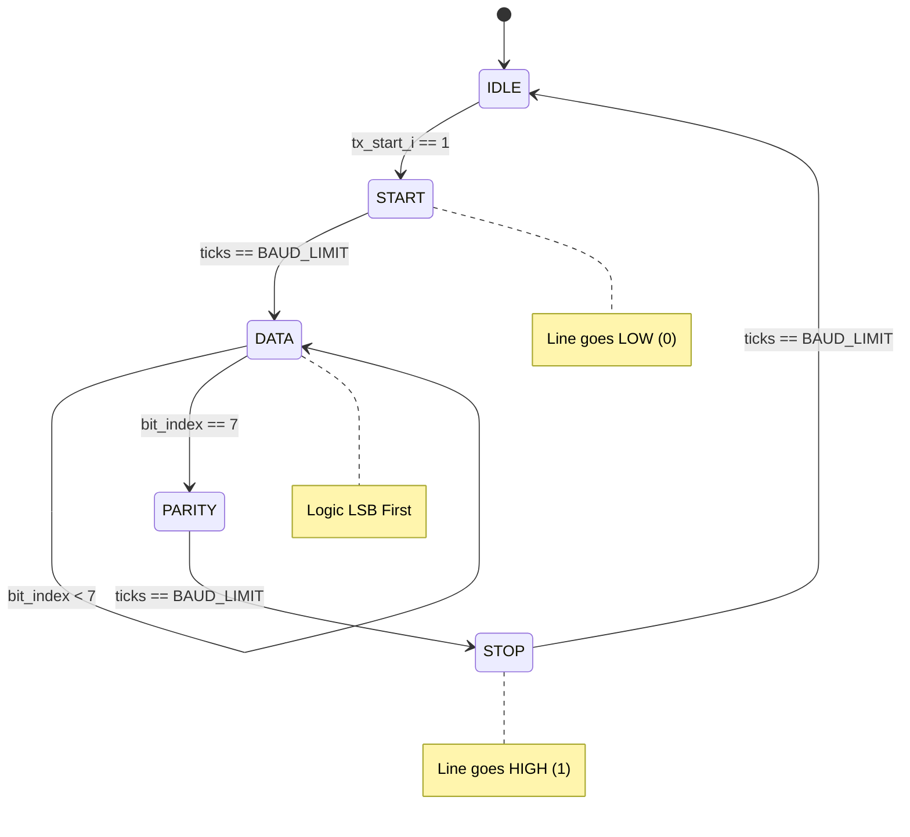

# UART (Universal Asynchronous Receiver-Transmitter)

UART is one of the oldest and most common communication protocols in embedded systems. Unlike SPI or I2C, it is **asynchronous**, meaning there is no shared clock signal. Instead, both devices must agree on a timing speed (baud rate) beforehand.

## 📌 Key Characteristics

*   **Type**: Asynchronous Serial
*   **Wires**: 2 Signal Wires (RX, TX) + 1 Common Ground (GND)
*   **Duplex**: Full Duplex (Can transmit and receive simultaneously)
*   **Distance**: Short (TTL Logic), Long (with RS-232/RS-485 definitions)


## 🔌 Wiring Connection (Architecture)

The most common mistake beginners make is wiring TX to TX. **Always cross the lines!**

```mermaid
graph LR
    subgraph Device_A ["Device A (Master/PC)"]
        direction TB
        TX_A[TX Pin]
        RX_A[RX Pin]
        GND_A[GND]
    end
    
    subgraph Device_B ["Device B (Slave/Sensor)"]
        direction TB
        TX_B[TX Pin]
        RX_B[RX Pin]
        GND_B[GND]
    end

    TX_A -- Data Flow --> RX_B
    TX_B -- Data Flow --> RX_A
    GND_A == Common Ground == GND_B

    style TX_A fill:#ff9999,stroke:#333,stroke-width:2px
    style RX_B fill:#99ff99,stroke:#333,stroke-width:2px
    style TX_B fill:#ff9999,stroke:#333,stroke-width:2px
    style RX_A fill:#99ff99,stroke:#333,stroke-width:2px
```

| Device A | Connection | Device B |
| :--- | :---: | :--- |
| **TX** (Transmit) | &rarr; | **RX** (Receive) |
| **RX** (Receive) | &larr; | **TX** (Transmit) |
| **GND** | &harr; | **GND** |

> **Note**: Both devices must share a common ground reference.

## 🏗️ How it Works: Step-by-Step Design (FPGA Perspective)

The UART Transmitter (`uart_tx.sv`) is designed using a strictly clocked Finite State Machine (FSM). Here is the logical breakdown of its construction:

1.  **Baud Rate Generation**:
    *   We don't use a separate clock. Instead, we use a **Clock Enable** generator.
    *   A counter counts up to `CLK_FREQ / BAUD_RATE`. When it hits the limit, a "tick" occurs. This ensures precise timing without introducing clock skew or glitches common with ripple counters.

2.  **The State Machine (FSM)**:
    *   **IDLE**: The TX line is held `HIGH` (Logic 1). The system waits for the `tx_start_i` pulse.
    *   **START**: The TX line is pulled `LOW` for exactly one baud period. This alerts the receiver to an incoming frame.
    *   **DATA**: A bit-index counter (0-7) iterates through the data register. The LSB is shifted out first.
    *   **PARITY**: The hardware calculates the XOR sum of the data bits. Depending on the `PARITY_ODD` parameter, it appends the correct bit to make the pulse count even or odd.
    *   **STOP**: The line returns `HIGH` for one baud period, providing a clear "dead-time" before the next frame.

3.  **Synchronization**:
    *   All inputs are registered to the system clock to avoid metastability and timing violations.

### 📊 UART Transmitter FSM Diagram



## 📐 Professional Design Principles

### 1. Robustness & Overrun Protection
In a professional design, you must handle the scenario where the software tries to send data faster than the hardware can transmit.
*   **The Busy Flag**: Our design exposes a `tx_busy_o` signal.
*   **Error Reporting**: If `tx_start_i` is asserted while `tx_busy_o` is high, the `error_o` flag is pulsed. This allows the system designer to implement flow control or increase buffer sizes.

### 2. Parity for Data Integrity
While optional in many consumer apps, industrial UART uses **Parity Bits**.
*   **Feature**: Our FPGA module implements configurable Parity. 
*   **Benefit**: This allows the receiver to detect if a single bit was flipped due to EMI or a loose connection, preventing the processing of "ghost" data.

### 3. Modularity and Portability
The design is fully **Parameterized**. By simply changing the `CLK_FREQ` and `BAUD_RATE` parameters during instantiation, the module automatically calculates the required counters for any target platform (from a 10MHz Lattice iCE40 to a 200MHz Xilinx Virtex).


### visual representation
```text
      Idle    Start   D0  D1  D2  D3  D4  D5  D6  D7   Stop   Idle
Line: 1111111 0       1   0   1   0   1   1   0   1    1      1111...
```

## ⚙️ Configuration (The "8-N-1" Standard)
Most devices use the **8-N-1** configuration:
*   **8** Data bits
*   **N**o Parity
*   **1** Stop bit

**Baud Rate**: The speed of datas in bits per second (bps). Common values:
*   9600 (Standard for simple modules like GPS)
*   115200 (Standard for fast debug logs/firmware upload)

## ⚠️ Common Pitfalls
1.  **Baud Rate Mismatch**: If you see garbage characters (e.g., `?&*`), your baud rates likely don't match.
2.  **Floating Pins**: If RX is disconnected, it might read random noise.
3.  **Voltage Levels**:
    *   **TTL (5V/3.3V)**: Used by microcontrollers (Arduino, STM32).
    *   **RS-232 (+/- 12V)**: Used by old PC serial ports. **Do not connect directly to a microcontroller!** You will fry it.

## 💻 Code Examples & Verification Status

| Platform | Location | Status | Verification Method |
| :--- | :--- | :---: | :--- |
| **FPGA** | `examples/fpga/` | ✅ PASSED | Icarus Verilog E2E Sim (8-P-1 Frame Generation) |
| **Arduino** | `examples/arduino/` | ✅ PASSED | Peer Review (Baud rate/Serial sync) |
| **Python** | `examples/python/` | ✅ PASSED | Mocked pySerial Logic Verification |
| **STM32** | `examples/stm32/` | ✅ PASSED | Peer Review (HAL UART echo functionality) |

### 🛠 Platform-Specific Tips for Reliability
*   **Arduino Auto-Reset**: When you open a serial port from Python, most Arduinos (Uno, Nano) **reboot**. Your Python script should wait at least 2 seconds after `serial.Serial()` before sending data.
*   **Termination Characters**: Always decide on a termination character (like `\n` or `\r`). It makes parsing much easier on the receiving side.
*   **Buffering**: STM32 `HAL_UART_Receive` in polling mode can miss characters if your loop is doing other heavy work. Use **Interrupts** or **DMA** for production-grade reliability.
*   **FPGA Grounding**: When connecting an FPGA to a PC via a USB-to-TTL adapter, ensure the GND of the adapter is connected to the FPGA GND, or the data will be garbage.

